# StudySync

A collaborative platform for student-organized academic support sessions built with the MERN stack.

## Overview

StudySync bridges the gap between formal university scheduling systems and student-led academic activities. It provides a centralized platform where students can create, manage, and join peer-led study sessions, tutorials, and academic workshops.

## Key Features

- **Session Management**: Create and manage academic study sessions with venue, timing, and capacity details
- **Smart Filtering**: Advanced filtering by topics, tags, and academic subjects
- **QR Code Attendance**: Automated attendance tracking with unique QR codes for each participant
- **Calendar Integration**: View sessions in an integrated calendar with your university schedule
- **Email Notifications**: Automated session invitations and updates
- **Analytics Dashboard**: Visual insights into session participation and platform usage
- **Hierarchical Topics**: Organized academic subject categorization
- **Mobile Responsive**: Optimized for use across all devices

## Technology Stack

**Frontend:**
- React.js with Vite
- Material-UI components
- Chart.js for analytics
- React Router for navigation

**Backend:**
- Node.js & Express.js
- JWT authentication
- RESTful API design
- Gmail API integration

**Database & Storage:**
- MongoDB with Mongoose ODM
- Azure Blob Storage for QR codes
- MongoDB Atlas (cloud database)

**Deployment:**
- Docker containerization
- DigitalOcean cloud hosting
- NGINX reverse proxy

## Application Screenshots

### Authentication & Login
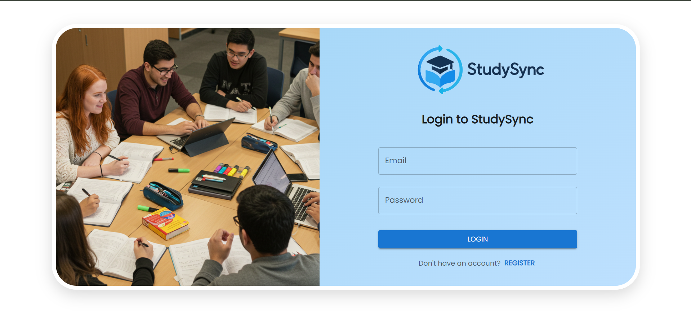

Clean and professional login interface with registration option

### Dashboard Analytics
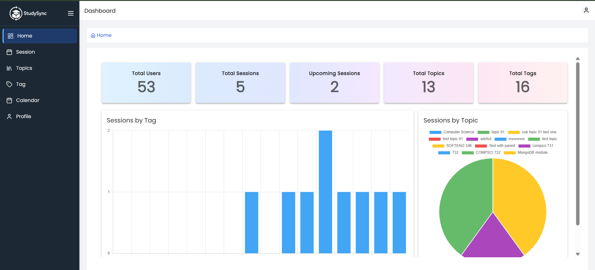

Comprehensive dashboard showing session statistics and visual analytics

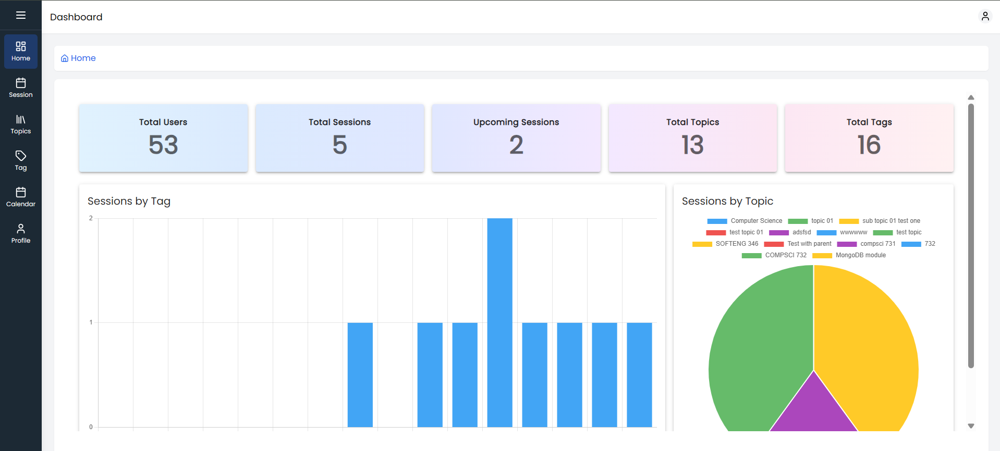

Mobile-responsive dashboard with collapsible navigation

### Session Management
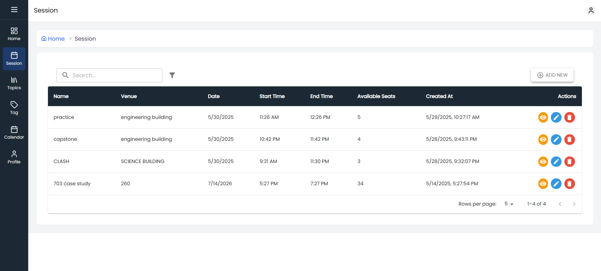

Complete session listing with search and filter capabilities

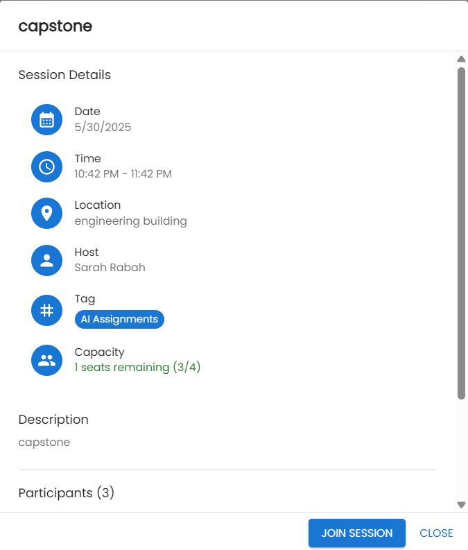

Detailed session view with participant management and QR code

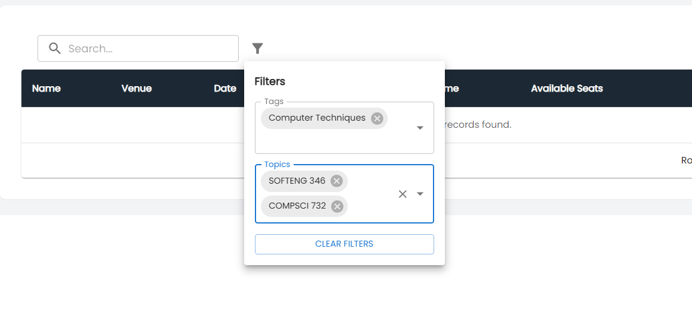

Advanced filtering by topics and tags for easy session discovery

### Calendar Integration
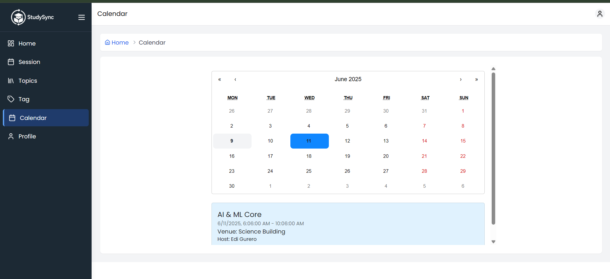

Integrated calendar showing upcoming academic sessions

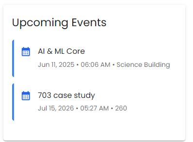

Quick overview widget showing upcoming sessions and events

### Email Notifications
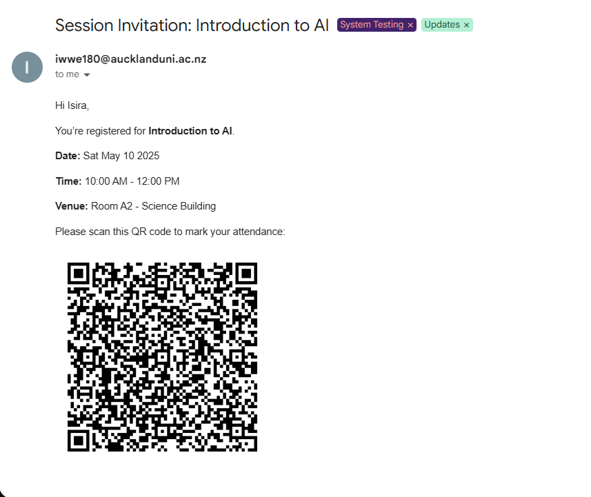

Automated email invitations with QR codes for attendance

### User Management
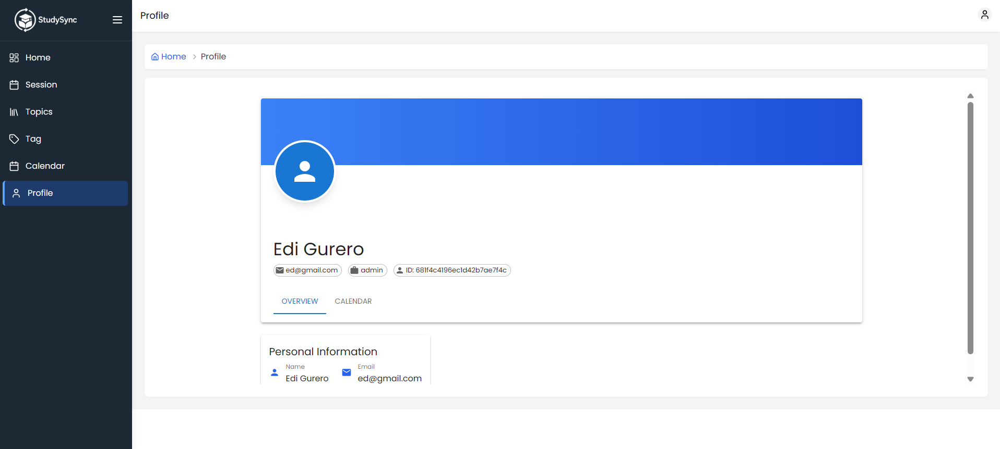

User profile management with session history

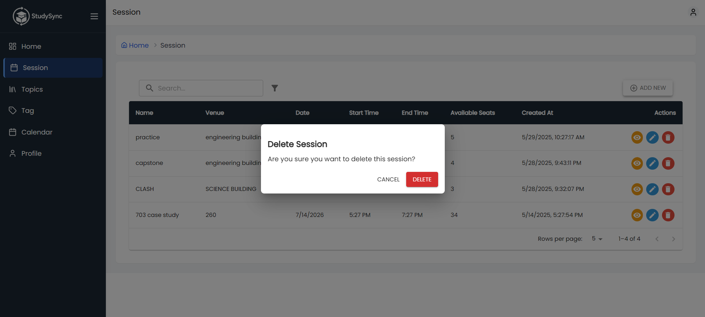

Secure session management with confirmation dialogs

## Core Functionalities

### For Students
- **Create Sessions**: Organize study sessions with academic context
- **Join Sessions**: Discover and enroll in relevant study sessions
- **Track Attendance**: Scan QR codes to mark attendance
- **Manage Schedule**: View sessions in integrated calendar
- **Receive Notifications**: Get email updates about sessions

### For Administrators
- **Platform Analytics**: Monitor usage statistics and trends
- **User Management**: Oversee user accounts and permissions
- **Session Oversight**: Manage and moderate study sessions

## Key Benefits

- **Centralized Coordination**: One platform for all student-led academic activities
- **Academic Context**: Organized by subjects and topics relevant to university courses
- **Automated Tracking**: QR code-based attendance eliminates manual processes
- **Seamless Integration**: Works alongside existing university systems
- **Enhanced Visibility**: Students can easily discover relevant study opportunities

## Development

Built using modern web development practices including:
- Component-based React architecture
- RESTful API design principles
- MongoDB NoSQL database
- JWT-based authentication
- Automated testing with Jest and React Testing Library
- Agile development methodology
- Docker containerization for deployment

---

Built for the academic community
